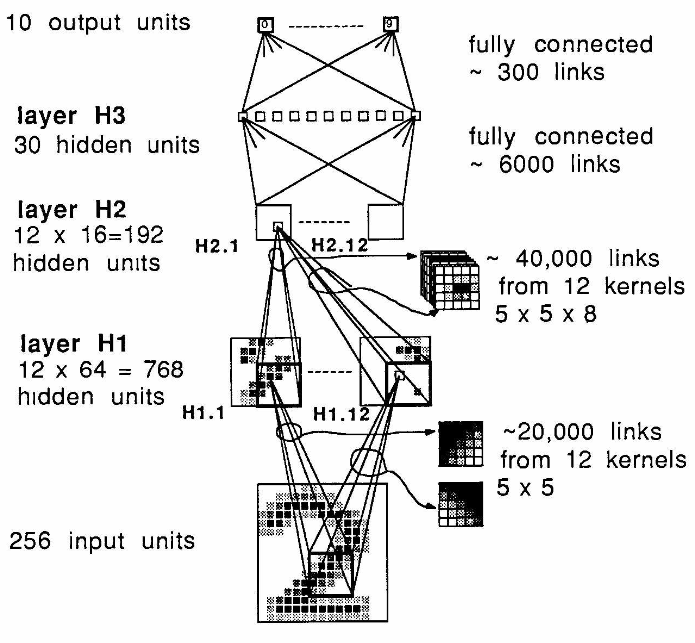

# lecun-backprop89
Implementation of [Backpropagation Applied to Handwritten Zip Code Recognition](https://ieeexplore.ieee.org/document/6795724) in PyTorch.




## Usage

## Notes

### Simulating the Dataset
They used in the paper *"9298 segmented numerals digitized from handwritten zip codes that appeared on U.S. mail passing through the Buffalo, NY post office. "*, but i cant find this dataset anywere, so i simulated it using MNIST.

## Citations

```bibtex
@article{LeCun1989,
  title     = {Backpropagation Applied to Handwritten Zip Code Recognition},
  author    = {Y. LeCun, B. Boser, J. S. Denker, D. Henderson, R. E. Howard, W. Hubbard, L. D. Jackel},
  journal   = {Neural Computation},
  year      = {1989},
  publisher = {MIT Press}
}
```