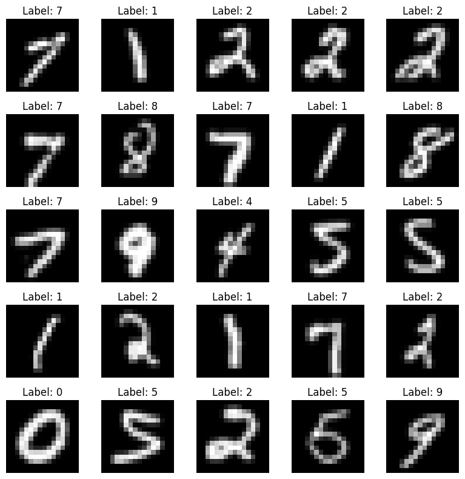
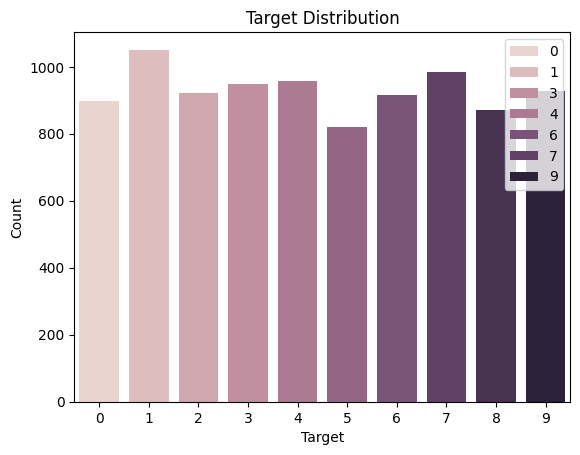

# LeNet-1989
Implementation of [Backpropagation Applied to Handwritten Zip Code Recognition](https://ieeexplore.ieee.org/document/6795724) in PyTorch.


## Usage

Just run:
```bash
python3 train.py
```

Creating the model:
```python
from lenet_1989.lenet1989 import LeNet1989


# creating the model
net = LeNet1989()

# forward pass
y_pred = net.forward(x)

# printing model stats
print(net)
```

```bash
Stats LeNet from 1989
total units:              1256
total connections:        64660
independent parameters:   9760
```


## Results

Results of the paper after 23 passes:

```bash
pass: 23
train report - loss: 0.00250     error: 0.0014   missclassifications: 10
test  report - loss: 0.01800     error: 0.0500   missclassifications: 102
```
My results after 23 passes:

```bash
pass: 23
train report - loss: 0.00101    error: 0.00521  missclassifications: 38
test  report - loss: 0.00811    error: 0.04933  missclassifications: 99
```

These results match pretty mutch the results from the original paper. Maybie with some hyperparameter optimization we will fit them mutch better.

## Notes

- They used in the paper *"9298 segmented numerals digitized from handwritten zip codes that appeared on U.S. mail passing through the Buffalo, NY post office. "*, i cant find this dataset anywere, so i simulated it using MNIST.

- For units in layer H1 that are one unit apart, theier receptive fields (in the input layer) are two pixels apart $ \rightarrow $ `Stride = 2` (same from H1 to H2)

- 1 Unit in H2.X with $X \in \{1, ..., 12\}$ has `8 * 5 * 5 = 200` inputs from eight of the $8 \times 8$ feature maps via the $5 \times 5$ kernels

- Not clear explanation how to select 8 of the 12 feature maps between H1 and H2, did it like @karpathy

- No information about used hyperparameters (i.e. learning rate)

- No information how bias was initialized (assume zero)

- They used MSE as a objective instead of cross-entropy

- I used one hot encoding on the targets, because of the MSE objective

- This Convolutional Neural Network is often called LeNet-1

## Insights about the Data

#### Viewing some random numbers



#### Number distribution



## Citations

```bibtex
@article{LeCun1989,
  title     = {Backpropagation Applied to Handwritten Zip Code Recognition},
  author    = {Y. LeCun, B. Boser, J. S. Denker, D. Henderson, R. E. Howard, W. Hubbard, L. D. Jackel},
  journal   = {Neural Computation},
  year      = {1989},
  publisher = {MIT Press}
}
```